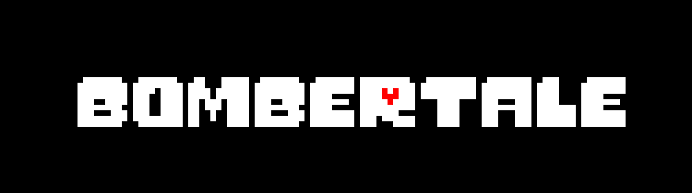
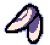
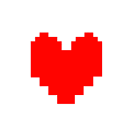
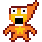
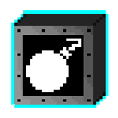

Bombertale is an Undertale fan-game that combines the classic game of Bomberman and combines it with the world of Undertale.

This game was orginally made as part of a networking class at UCI and was created to demonstrate our knowledge of networking and applying it to video games.

The game supports both Local and Online Multiplayer games of up to 4 different players.

## Getting Started

There is currently not a build available for download, but we hope to put one up on itch.io sometime in the near future.

For now, you will need to open our game in Unity 5.5.0f3 and build it maunally from there. The Windows Operating System is preferred as we built most code for Windows, and did not do as much bug testing for Mac builds, but the project will build for Mac as well.

## Controls
### Local

#### Player 1

WASD - Movement

Space - Drop Bomb

#### Player 2

Up, Left, Right, Down Arrow Keys - Movement

Left Click - Drop Bomb

#### Player 3

5, 1, 2, 3 - Movement

0 - Drop Bomb

#### Player 4

I, J, K, L - Movement

P - Drop Bomb

### Online

WASD - Movement

Space - Drop Bomb

## How To Play
To win the game defeat everybody else to be the last person standing!

Collect powerups to help you!

### Ballet Slippers

_These used shoes make you feel incredibly dangerous. Picking this up increases your movement speed._

### Heart of Determination

_As you survive all this chaos around you, you can't help but feel a little satisified that you're still alive. Picking this up grants you temporary invincibility._

### ???

_Did you remember his name? He's dying to know if you did. Picking him up will increase the explosion length of your bombs._

### Extra Bomb

_WHERE DID YOU EVEN GET THESE? WHY ARE THEY JUST LYING AROUND? Picking this up will give you another bomb to use._

## Built With
Unity 5.5.0f3

## Contributing
This was the first time any of us ever tried making a networked game, if there is anyone that would like to contribute to this and improve our networking code, you are more than welcome too!

All contributions will be up for review before being committed; however, most contributions are welcome, as long as they help to make this game great and fun!

## Authors
* [**Efren Aguilar**](https://github.com/efrenaguilar95) - Sound, Music, Programming
* [**Alex Deuling**](https://github.com/apedestrian) - Programming, Databases
* [**Roldan Gammad**](https://github.com/rgammad) - Programming, Design
* [**Edwin Ho**](https://edwinho555.itch.io/) - Programming, Design
* [**Peter Truong**](https://pgtruong.github.io/) - Programming

## License

This project is free for all to use and learn from. All we ask is that anything that may be taken from this project be credited to us.

Any code or assets made by us cannot be used for monetary purposes unless approved by our team.

All arts and assests taken from Undertale are owned by Toby Fox and as such all rights for those go to him.
